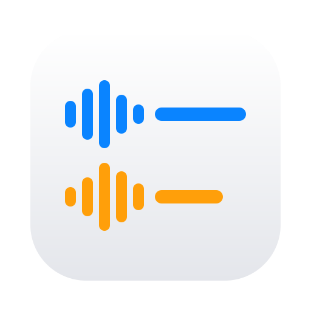

# Scribe

A free call transcriber for the Mac. It works with Zoom, Google Meet, WhatsApp, FaceTime, or anything else that talks through your speakers, and it doesn't need a bot to join the call.

## Why I made this

A while ago I was on an important sales call. A few minutes in I realized we were on *their* Google Meet, not mine, which meant my note-taking bot was sitting in the waiting room. To get a transcript I'd have had to ask the buyer, in the middle of a pitch, to please let my robot in. I didn't. It felt like asking someone to let you record them while you're trying to get them to trust you.

So I had no transcript. Afterwards I tried to reconstruct what they'd told me, and I'd missed things that turned out to matter. I closed the deal, but barely.

That happened a few more times. I tried other tools. They were either bots, which have the same problem, or they ran big speech models that made my laptop work hard for an hour after every call. Then I noticed that my Mac was already pretty good at turning speech into text. It's been doing it for dictation for years, and it's built into the system. So I built the thing I actually wanted on top of that.

## Who it's for

People who spend their days on calls and don't like taking notes: founders, salespeople, coaches, managers. If you've ever finished a call and thought "wait, what was the number they said?", this is for you.

## What's different

**There's no bot.** Nobody gets a "Scribe Notetaker wants to join" message. It doesn't matter whose meeting it is or which app it's in. Scribe listens on your Mac, the same way you do.

**Your audio stays on your Mac.** The recording and the transcript are files on your disk. There's no account and no server. (One caveat: English is transcribed entirely on your Mac. For other languages, macOS sends the audio to Apple's speech service, the same one dictation uses.)

**It's light.** Scribe uses the speech recognizer that's already in macOS rather than shipping its own model. The app is about 2 MB, an hour of call is about 30 MB of audio.

**It knows who said what.** Your microphone is "Me" and whatever comes out of your Mac is "Them". For the usual one-on-one call, that's all the speaker detection you need, and it doesn't have to guess.

**It's free.**

## Why now

Until recently the built-in transcription wasn't good enough to be worth keeping. Now it is, at least for what most of us actually do with transcripts: paste them into Claude or ChatGPT and ask "what did they agree to?", "what objections came up?", "write the follow-up email". An AI reading the transcript doesn't need every word to be perfect. It needs the conversation, and it needs it without you having to ask anyone's permission.

## Compared to what I was using

I pay for both of these, and both are good at what they do.

| | Scribe | Fathom | MacWhisper |
|---|---|---|---|
| How it hears the call | On your Mac | A bot joins the call | On your Mac |
| Works on someone else's meeting without asking | Yes | Only if they let the bot in | Yes |
| Where your audio goes | Stays on your Mac (English) | Their servers | Stays on your Mac |
| Transcription engine | Built into macOS | Cloud | Whisper models you download |
| Load on your Mac | Barely noticeable | None | Heavy, especially with the better models |
| Summaries and analysis | Paste into your own AI | Built in | Some built in |
| Price | Free | Free tier, paid plans | Free version, paid Pro |

Fathom is great when you own the meeting and everyone expects a notetaker. MacWhisper is great for transcribing recordings as accurately as possible. Scribe is for the rest of your calls, where you just want a transcript without making it anyone else's business.

## Install

1. Download `Scribe-1.0.0.dmg` from [Releases](https://github.com/finereli/scribe/releases) and drag Scribe to Applications.
2. Open it. macOS will ask for three permissions: **Microphone** (your side), **Speech Recognition** (the transcript), and **System Audio Recording** (their side). Allow all three.

Requires macOS 14.2 (Sonoma) or later. Built for both Apple Silicon and Intel Macs.

## Use

1. Pick the call's language (English, Hebrew or Russian).
2. Press the red button (or ⌘R) when the call starts. Check that the **Me** and **Them** meters move.
3. Talk. The transcript appears as you go.
4. Press stop, then copy the transcript and paste it wherever you think.

Every call is kept in its own folder (the folder icon opens it) with both sides recorded separately, so you can re-transcribe them later with anything you like.

## Good to know

- **Use headphones.** If the other person comes out of your speakers, your mic hears them too, and some of their words end up under "Me".
- **When you talk over each other**, one side's words show up a few seconds late. macOS transcribes one stream at a time, so Scribe takes turns. Nothing is lost.
- **"Them" is everything your Mac plays.** A notification sound or a song during the call gets recorded too.
- **One language per call.** The built-in recognizer can't switch languages mid-sentence.

## Build from source

Scribe is a small SwiftPM app with no dependencies.

```sh
./build.sh          # local build
open Scribe.app
```

`SIGN=1 ./build.sh` signs it with a Developer ID, and `NOTARIZE=1 ./build.sh` also notarizes it.

## License

MIT
